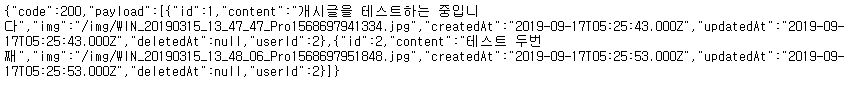

# Node_Call
## 호출
----
1. Node_API 의 서버구동
2. Node_Call 호출
3. 토큰이 발급 되었을 경우

---

localhost:8003/mypost
 로 이동한다면  와 같이 내 게시글 확인 가능
---
<h1>CORS</h1>
라는 표현이 나오는데 이는 
Cross Origin Resource Sharing
 로 다른페이지의 자원을 현재 페이지에서 사용하는것을 의미한다